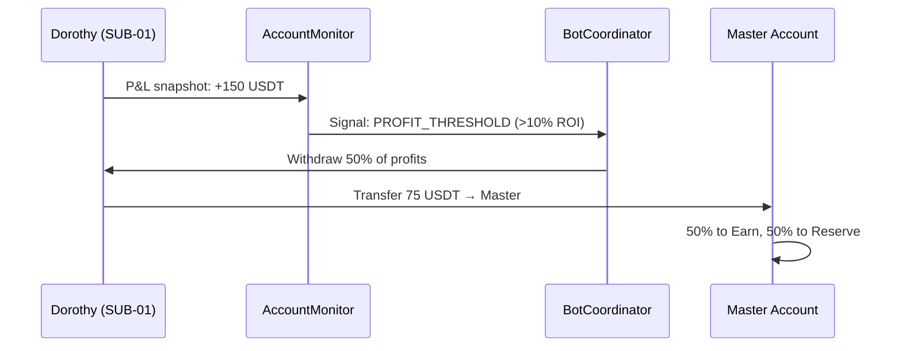

# Capital Flow — Contribution, Distribution, and Resource Circulation

> **Fecha:** 2026-05-06
> **Status:** Architectural Design (Pre-subaccount implementation)
> **Reference:** Phase 2 of the Evolution Plan

---

## 1. Account Architecture

```
╔══════════════════════════════════════════════╗
║              MASTER ACCOUNT                  ║
║         (Binance Master Account)             ║
║                                              ║
║  ┌──────────┐  ┌──────────┐  ┌──────────┐   ║
║  │ COLD     │  │ EARN     │  │ FREE     │   ║
║  │ RESERVE  │  │ ACTIVE   │  │ LIQUIDITY│   ║
║  │ (HODL)   │  │ (Yield)  │  │ (Deploy) │   ║
║  └────┬─────┘  └────┬─────┘  └────┬─────┘   ║
╚═══════╪═════════════╪════════════╪═══════════╝
        │             │            │
        ▼             ▼            ▼
╔═══════════╗ ╔═══════════╗
║  SUB-01   ║ ║  SUB-02   ║
║  Dorothy  ║ ║  Elphaba  ║
║  (Long)   ║ ║  (Short)  ║
╚═══════════╝ ╚═══════════╝
```

---

## 2. Contribution Mechanism (How do funds enter?)

### 2.1 Initial Contribution (Funding)
The operator deposits USDT/crypto into the Binance **Master Account**.
From there, it is distributed manually or (in the future) via the
`AccountMonitor + BotCoordinator`:

```
Operator → Deposit → Master Account → Distribution
```

### 2.2 Specific Contribution to a Bot or System
To direct capital to a specific bot:

| Método | Mecanismo | Estado |
|--------|-----------|--------|
| **Direct (current)** | Transfer USDT from master account to subaccount via REST API (`POST /sapi/v1/sub-account/universalTransfer`) | Available (Phase 2) |
| **Via Coordinator** | `bot_coordinator.allocate(bot_id, amount_usdt)` — the coordinator executes the transfer and records it in TelemetryVault | To implement |
| **Via Dashboard** | Button in Flutter: "Fund Dorothy +500 USDT" → calls the coordinator REST endpoint | To implement |

### 2.3 Group Contribution
To fund "all trend-following bots":

```python
# Concept: the coordinator groups bots by type and distributes equally
coordinator.allocate_group(
    group="trend_bots",  # dorothy instances
    total_usdt=1000,
    distribution="equal",  # o "weighted_by_winrate"
)
```

---

## 3. Resource Distribution (Where do they go?)

### 3.1 Base Distribution Rule

```
100% Available Capital
  ├── 30% → Cold Reserve (HODL, long-term accumulation)
  ├── 20% → Active Earn (staking, savings — passive yield)
  ├── 10% → Emergency Liquidity (never touch except in panic)
  └── 40% → Working Capital (distributed among active bots)
        ├── Dorothy: up to 50% of working capital
        └── Elphaba: up to 50% of working capital
```

### 3.2 Destination by Subaccount

| Subcuenta | Bot(s) | Capital Máx | Función |
|-----------|--------|-------------|---------|
| SUB-01 | Dorothy | 50% working | Symmetric Scalp Long |
| SUB-02 | Elphaba | 50% working | Symmetric Scalp Short |
| SUB-03 | (Reserve) | — | Rotating capital, buffer |
| SUB-04 | (Earn) | — | Active Savings/Staking |

---

## 4. Circulation (How do funds return and rotate?)

### 4.1 Profit Taking



**Rule:** When a bot accumulates >10% ROI on its allocated capital,
the coordinator automatically extracts 50% of the profits and
redirects them to the master account for redistribution.

### 4.2 Periodic Rebalancing (Monthly)

```
Day 1 of each month:
1. AccountMonitor takes a snapshot of ALL subaccounts
2. Calculates: Who is over-capitalized? Who needs more?
3. Generates rebalancing signals (rebalance_signals table)
4. The operator approves (or auto-approval if <5% of total)
5. Coordinator executes inter-subaccount transfers
6. Everything is recorded in TelemetryVault (bot_decisions)
```

### 4.3 Move to Earn (Accumulating Assets)

Assets that do not need immediate liquidity (BNB, SOL, ETH in HODL)
are moved to Flexible Savings or Staking:

```python
# Concept
coordinator.move_to_earn(
    asset="BNB",
    amount="10.5",
    product_type="FLEXIBLE_SAVINGS",
    source_account="SUB-01",
)
```

### 4.4 Complete Circular Flow

```
Deposit → Master → Subaccounts → Bots operate → Profits
                ↑                                       │
                └───── Profit Take ← Rebalancing ←────────┘
                           │
                           ├── Earn (passive yield)
                           └── Reserve (accumulation)
```

---

## 5. Current Status Summary

| Componente | Estado | Responsable |
|------------|--------|-------------|
| Rebalancing need detection | ✅ Implemented | `AccountMonitor.rebalance_signals` |
| Balance snapshot | ✅ Implemented | `AccountMonitor.record_snapshot()` |
| Decision logging | ✅ Implemented | `TelemetryVault.log_decision()` |
| Inter-subaccount transfer | ⏳ Phase 2 | `BinanceGateway` (needs endpoint) |
| Auto-profit-taking | ⏳ Phase 2 | `BotCoordinator` (needs logic) |
| Move to Earn | ⏳ Phase 2 | `BinanceGateway` (needs endpoint) |
| Capital flow dashboard | ⏳ Phase 3 | Flutter UI |

> **The data infrastructure is ALREADY ready.** What is missing is the transfer
> execution logic and the business rules for automatic profit-taking.
> That comes with subaccounts in Phase 2.
